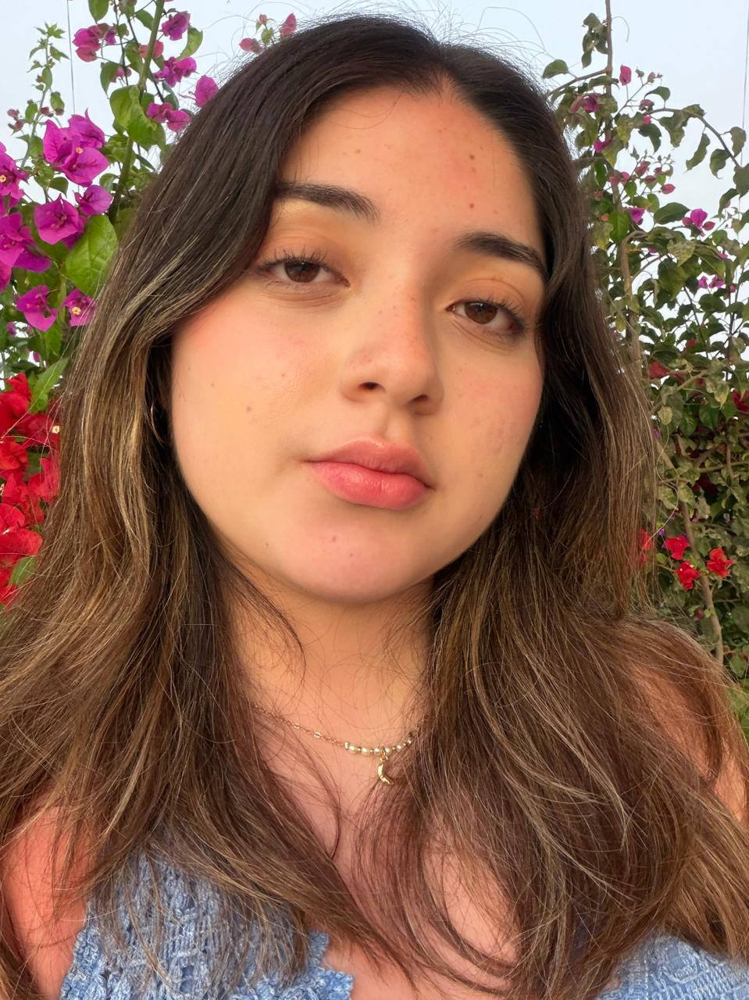
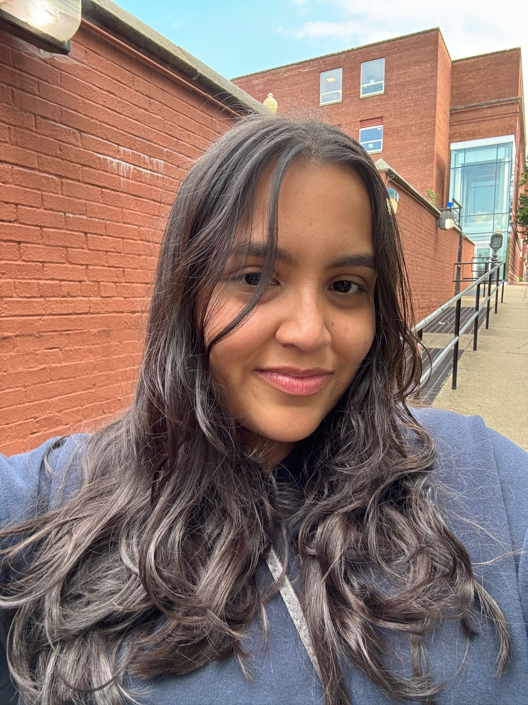
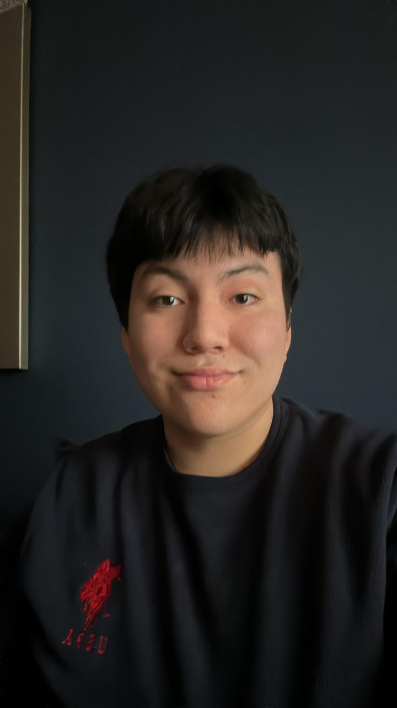
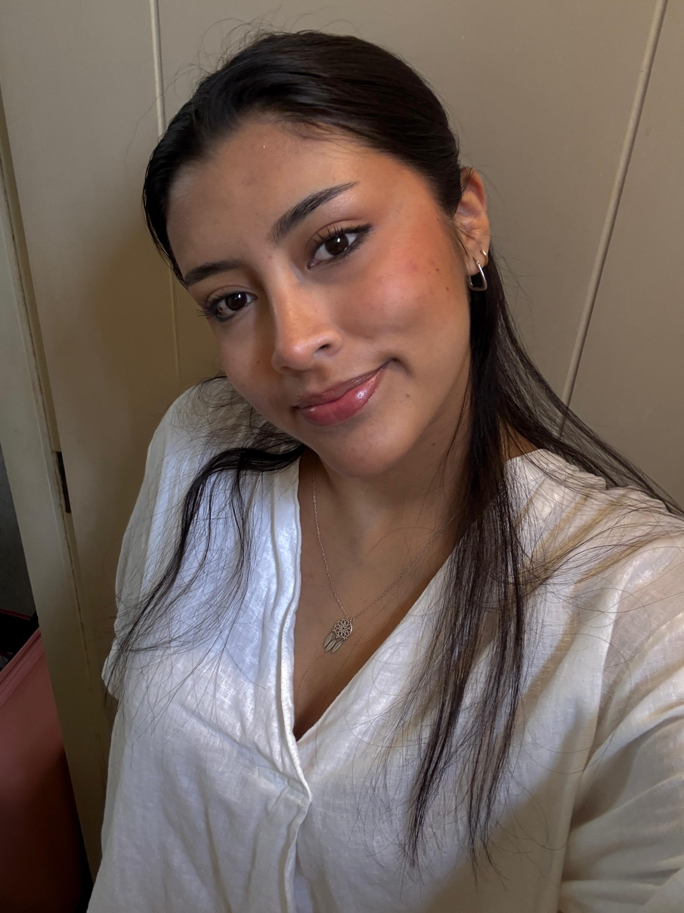
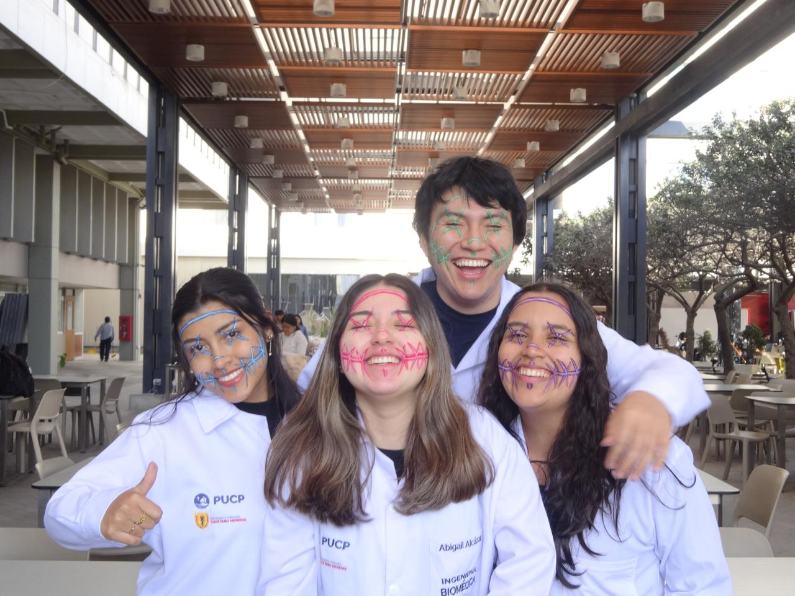

<h1 align="center">Grupo2-ISB-2026-II</h1>

## ¿Quiénes somos?

¡Bienvenidos! Somos estudiantes de Ingeniería Biomédica de septimo ciclo y estamos llevando el curso de **Introducción a Señales Biomédicas**.

En este repositorio iremos subiendo nuestros laboratorios, avances del proyecto y otros trabajos que realicemos durante el curso.

A lo largo del curso buscamos aprender a trabajar con distintos tipos de señales biomédicas, desde su adquisición hasta su procesamiento y análisis, aplicando estos conocimientos a problemas relacionados con la ingeniería y la salud.

## Integrantes

| Integrante | Presentación |
| :---: | :---: |
| 
**Abigail Karina Alcazar Vargas**  
 | Estudiante interesada en el análisis de señales médicas y sus aplicaciones en el área de la salud. |
| 
**Mariel Andrea Brachowicz Suarez**  
 | Estudiante interesada en la ingeniería de tejidos y biomateriales, especialmente en bioimpresión 3D.|
| 
**Julio Alonso Vasquez Tantalean**  
 | Estudiante interesado en biomecánica, con especial interés en el desarrollo de prótesis de miembro inferior. |
| 
**Ana Paula Vela Velasquez**  
 | Estudiante interesada en dispositivos médicos y el procesamiento de imágenes y señales provenientes de los mismos. |

  

## Contenido del repositorio

- `CITI program - certificados/`: Certificados CITI de los integrantes del equipo.
- `IMAGENES/`: Imágenes utilizadas en la documentación del repositorio.
- `LABORATORIOS/`: Actividades y trabajos realizados durante las sesiones de laboratorio.
- `PROYECTO/`: Documentación y avances del proyecto del curso.
- `ANEXOS/`: Material complementario relacionado con los laboratorios y el proyecto.

